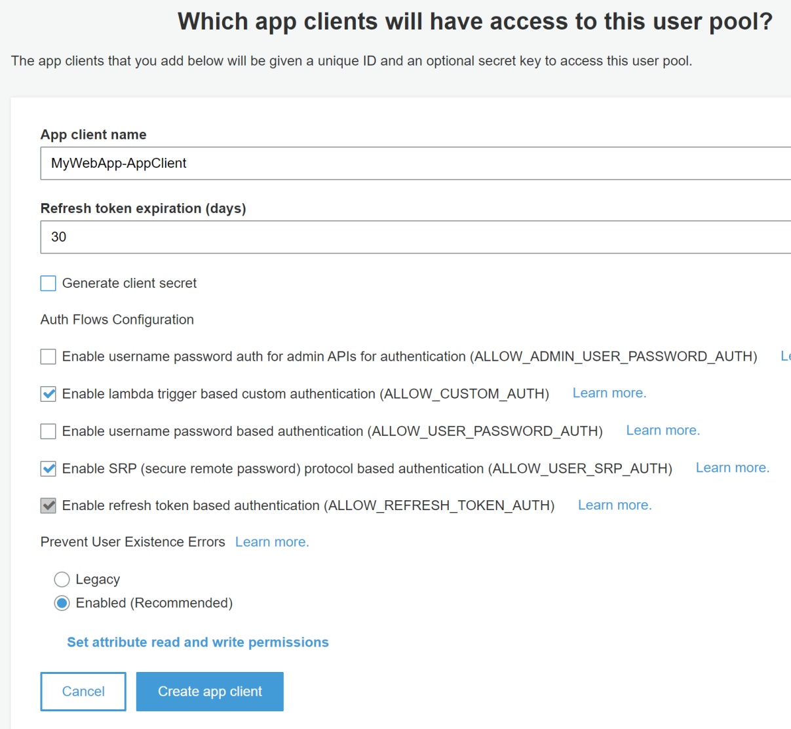
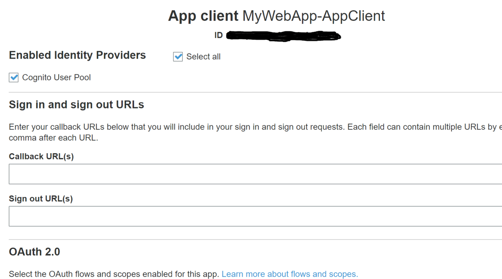
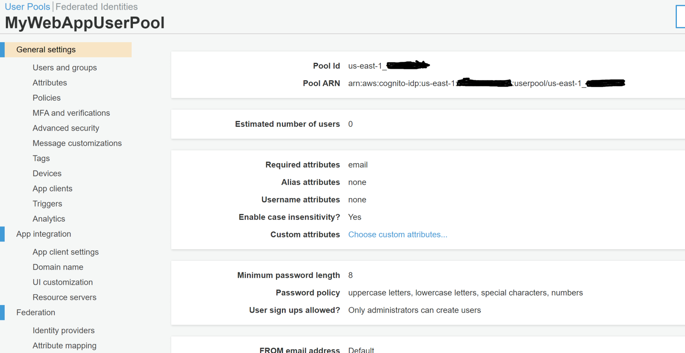
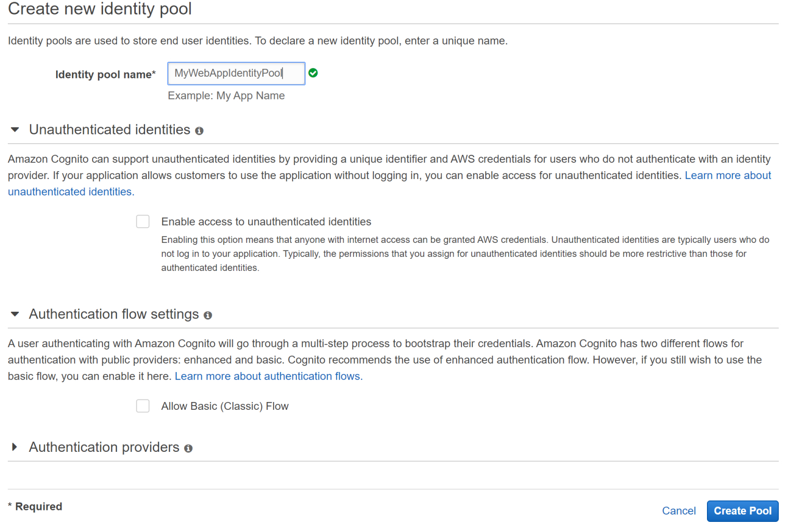
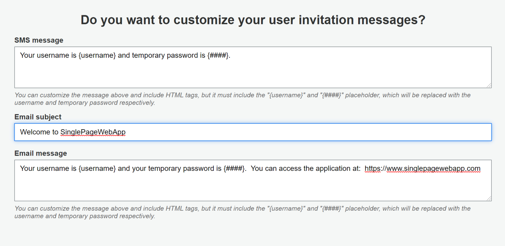

# Overview
After building several single page web applications (i.e., html + JavaScript + AJAX / JQuery), for different clients, I decided to develop this generic, starting-point template.  It provides a working, base-solution that employs AWS Cognito to both authorize web application end users and to manage the associated user logon ids and passwords.  This template is composed of a single html file and two JavaScript files.  The README.md file for this repository provides prescriptive guidance for building out the bare minimum AWS infrastructure to get things working (i.e., Cognito User Pool, Cognito Identity Pool, IAM Roles, and Cognito User Pool users.)

The remainder of this document is organized into the following sections:
* Sourcing JavaScript Files
* AWS Set Up
* Managing Users
* Update Your Single Page Web Application Code

## Sourcing JavaScript Files
This template’s html file, SinglePageWebApp.html, loads two JavaScript files, both of which can simply be hosted adjacent to the html file on a web server.  Of these two JavaScript files, one of them, aws-sdk-2.331.0.min.js, can be reliably sourced from Amazon (i.e., https://sdk.amazonaws.com/js/aws-sdk-2.331.0.min.js) should you decide to not collocate it with the html file.  Including the aws-sdk-2.331.0.min.js file enables an html page to work with a number of AWS services.  Unfortunately, Cognito is not one of them.

The second JavaScript file, amazon-cognito-identity.min.js, cannot be directly sourced from a publicly available Internet endpoint.  Obviously, you can source it from this GitHub repository, but should you be interested in sourcing it yourself, then read the rest of this section.

In early 2018, I found that the most straightforward way to source the amazon-cognito-identity.min.js file was to do so using NPM (https://www.npmjs.com).  In case you can benefit from some background information… NPM is a package manager for the JavaScript programming language.  It is the default package manager for the JavaScript runtime environment Node.js.  NPM consists of a command line client, also called npm, and an online database of public and paid-for private packages, called the npm registry.  

After installing NPM on my local machine I downloaded the “AWS Cognito Identity SDK for JavaScript” bundle from the npm registry.  If you navigate to https://www.npmjs.com/package/amazon-cognito-identity-js,  on the top right-hand side of the page you should see a command, that you can paste into your local machine’s clipboard and execute at a command line to download the bundle.   Alternatively, you can manually type the command “npm i amazon-cognito-identity-js” into a command line prompt on your local machine; obviously, this machine will need to have npm installed on it.  If you are not sure if a machine has npm installed on it, type the command “npm -v“ at a command line prompt.  Version information will be displayed if you have npm installed (assuming you don’t have path issues that prevent the command npm from being resolved properly.)  I’m certainly not a JavaScript expert, so don’t quote me on this, but I believe that installing Node.js on a machine will also install npm on that machine.   On a Windows 10 machine, by default, the bundle should download into a location similar to “C:\Users\\<user name>\node_modules\amazon-cognito-identity-js.”  If the download command fails to execute properly you might consider opening up permissions of the download target folder (e.g., temporarily open it up to the world.)  

After you have downloaded the AWS Cognito Identity SDK for JavaScript bundle, it comes down to a matter of locating the file “amazon-cognito-identity.min.js” within the directory structure of the bundle itself. 

## AWS Set Up
In order to use AWS Cognito to authenticate users of your web application, at a minimum, you will need to create a Cognito User Pool, a Cognito Identity Pool, and two IAM roles (default roles will be generated for you that you can edit if you like.)  Things will go a little smoother for you if you create the User Pool before creating the Identity Pool.  Also, I’d recommend that you note down IDs and ARNs as you build out the infrastructure.

### Cognito User Pool
Create an appropriately named Cognito User Pool (e.g., “MyWebAppUserPool”.)  This pool will manage user logons to your web application.  Any number of configurations will work but I found the following configuration works well for the type of general purpose, JavaScript-based, single page web applications that I find myself building time and time again.  

As this is a basic template, when you navigate to the Cognito service in the AWS console and select “Manage User Pools” followed by the “Create a user pool” button, you can choose the “Review Defaults” option versus the “Step Through Settings” option.

With the default settings, the only change that I make is in the third box down in the middle of the page that has the following attributes: “Minimum password length”, “Password policy”, and “User sign ups allowed?”.  I change the default setting of the “User sign ups allowed?” property from its default value of “Users can sign themselves up” to “Only administrators can create users” but this change is up to you.  It comes down to whether you have a low volume of users or a large volume that would overwhelm an administrator(s).

Since you will need to create an “App Client” you might as well go ahead take care of this as part of creating the User Pool.  

If you need some background on what an AWS Cognito User Pool “App Client” is, it is an entity within a User Pool that has permission to call unauthenticated APIs.  Unauthenticated APIs are those that do not have an authenticated user making the call (e.g., register a new user, user sign in, process a “forgot my password” request from a user.)  To call unauthenticated APIs, you need to add an App Client ID and potentially a Client Secret.  When you create an App Client you take on the responsibility of securing the App Client ID and Client Secret for the App Client.  

When you create an App Client you have the option to create a Client Secret for it.  Browser-based applications written in JavaScript may not require use of a Client Secret.  Client Secrets cannot be changed after a Client App has been created.  In order to rotate the value of the Client Secret you need to create a new App Client with a new Client Secret and then delete the old App Client. 

Since this template is a JavaScript-based, single page web application, I do not create a Client Secret for the User Pool App Client created in these instructions.

Back to creating the “App Client.”  Click on the “App clients” text on the left-hand side of the page.  On the resulting page select “Add an app client.” On the resulting page supply a name for the App Client and unselect the “Generate client secret” check box (recall that this template is a JavaScript-based web application and does not require a Client Secret).  Other than that change, leave all of the other default settings and select “create app client.”  You should see something like this.



After you select “create app client” you will need to select “return to pool details” in order to finish configuring the User Pool.  When you do so your display will now show “MyWebApp-AppClient” in the “App clients” section.  Select the “create pool” at the bottom of the page in order to create the User Pool.  You should receive a message such as “Your user pool was created successfully.”   On the screen that displays this success message you can obtain the App Client Id by clicking on the “App client settings” text in the “App integration” section on the left-hand side of the screen.  You will find the ID located toward the top of the section providing the App Client details.   On this screen you need to check the box next to “Cognito User Pool” under the “Enabled Identity Providers” section.  Since my User Pool only has one identity provider to choose from this results in the simultaneous selection of the “Select All” check box next to the title of the section.  Ensure that you save this setting change. It should look something like this.



Two more values that you should note are the User Pool ID and the User Pool ARN.  You can obtain those by selecting the “General Settings” text for your newly created User Pool and looking towards the top of the right-hand side of the screen.  This is an example of what you should see.



Before we leave the User Pool, there is one more thing to note.  If you have to invite new users to your web application at scale you will probably want to do this with invitation emails.  On the Cognito User Pool display section of the AWS console you will see the link titled “Message customizations” on the left-hand side under the “General settings” section.  You can use this feature to automatically generate and send invitation emails to new users.  All you have to do is to select a “Create user” button on the screen that results when you select the “Users and Groups” link in the section titled “General settings” and then fill in a few fields in the resulting pop up screen in order for the email to be automatically generated and sent to the new user.

Based on personal experience, things will go much more smoothly if you will precompile a list of all your web application’s users.  The primary purpose of this list is to capture a valid email address for each user that will serve as a logon id, as well as a means to invite the new user to access the web application.  By default, Cognito User Pools will use the Cognito service itself to generate and send invitation emails to new users but there is a daily limit as to how many emails that it can send.  You can get around this daily email limit by using SES to generate and send these invitation emails but that requires an additional integration step.  I find that using a new user’s email address as their log in id as well, is more efficient and less error prone.

### Cognito Identity Pool
Now that you have finished creating the Cognito User Pool it is time to create the Cognito Identity Pool.  Identity Pools allow authenticated users (i.e., authenticated by the User Pool) to gain access to your web application.  Once you properly configure the integration between the Cognito User Pool and the Cognito Identity Pool, the Cognito Identity Pool will obtain temporary IAM credentials, via IAM’s Security Token Services.   

You can use the following steps to set up the Cognito Identity Pool.  On the landing page for the Cognito service, select the “Manage Identity Pools” link.  On the resulting page select the “Create new Identity pool” button.  On the resulting screen give the Identity Pool a name and ensure that in the “Unauthenticated identities” section that the check box to the left of “Enable access to unauthenticated identities” is unchecked.  Other than this change, leave all of the other default values in place.  Your “Step 1” screen for creating the Identity Pool should look like this:



Before selecting the “Create Pool” button you need to integrate this Identity Pool with the User Pool that you previously created.  Expand the section on this page titled “Authentication providers.”  On the resulting screen ensure that the “Cognito” tab is selected.  In the User Pool ID input box enter the value noted down earlier after creating the User Pool.  Ensure that you keep the AWS region prefix at the beginning of the id.  In the App client id input box enter the value that you noted down when you created the App Client Id inside of the User Pool you created.  Once you have entered these two values select the “Create Pool” button.

After selecting the “Create Pool” button you will land on a page explaining that, from a Cognito perspective, there are two types of users for your application: those that have been authenticated (e.g., by Cognito User Pools, by Facebook, by Google, etc.) and those who have not been authenticated.  Two different IAM roles will be automatically generated for you for each user type.  The reason for two separate IAM roles is that it enables you to differentiate access levels to your application between authenticated users and unauthenticated users.  For this basic template example, go ahead and select the “Allow” link in order to complete creation of the Identity Pool.  For more complex single page web applications, I’ve used the “View Details” section of this page to tweak the automatically created permission levels.  But this doesn’t have to be done during the creation of the Cognito Identity Pool.  You can certainly go into IAM after creating the Identity Pool and tweak the permissions.  

Here is an example tweak that I made for a single page web application that that uses CloudFormation to deploy applications on AWS resources.  I’ve shown the policy that I used during development because the final production policy wound up being large, complex, and a bit hard to follow. 
```
{
    "Version": "2012-10-17",
    "Statement": [
        {
            "Effect": "Allow",
            "Action": [
                "mobileanalytics:PutEvents",
                "cognito-sync:*",
                "cognito-identity:*"
            ],
            "Resource": "*"
        },
        {
            "Effect": "Allow",
            "Action": [
                "cloudformation:*"
            ],
            "Resource": "*"
        },
        {
            "Effect": "Allow",
            "Action": "iam:PassRole",
            "Resource": "arn:aws:iam::123456789012:role/AWebAppName"
        }
    ]
}
```

After selecting the “Allow” button to complete creation of the Cognito Identity Pool, you wind up on a “sample code” page and it’s not a bad idea to save off the sample code, just until you get things working.  Here is what the sample code looked like for me when I was running through the process to create this README.md document:

```
// Initialize the Amazon Cognito credentials provider
CognitoCachingCredentialsProvider credentialsProvider = new CognitoCachingCredentialsProvider(
    getApplicationContext(),
    "us-east-1:12345678-1234-1234-1234-123456789012", // Identity pool ID
    Regions.US_EAST_1 // Region
);
```

After you are done reviewing the “Sample code” page you should note down some details of your newly created Cognito Identity Pool.  One of these can be seen in the sample code above.  To source these details while on the “Sample code” page look to the right-hand corner to find the “Edit Identity pool” link.  Clicking on this link will bring you to an edit page where you can source the Identity Pool ID and the Identity Pool ARN (though you will have to click on the “Show ARN” link to see it).

## Managing Users

In order for your web application to authenticate end users against a Cognito User Pool, you have to first add end users to the User Pool.  If there is any kind of scale involved in the number of end users, you will probably want to invite new users to your application with an invitation email.

Go to the Cognito User Pool screen and select the User Pool that you recently provisioned.  Under the “General settings” section on the left-hand side of the screen you can select the “Message customizations” section.  I have never run into issues stemming from the daily email limit constraint imposed by Cognito, so I use it to generate and send email for my single page web applications.  Therefore, I leave most of the default settings on this page alone and scroll down to the bottom of the page where I make a few minor edits.   I always send invitation emails to new users, instead of texts, and I include the web application URL as well as the user id and the temporary password.   

Below you can see how things look after the few minor edits that I make at the bottom of the page.  Obviously, for your web application you would replace the URL in this message but you definitely need to leave the literal strings ‘{username}’ and ‘{####}’ in your welcome message.  These two strings serve as place holders and will be replaced with unique values for each separate user based on input that you provide in the pop-up dialogue that follows from selecting the “Create user” button.




To create a new user for your web application, select the “Users and groups” link under the “General settings” section of the top-level display screen for your newly created User Pool.  From the screen that pops up select the “Create user” button.  On the pop-up screen that results from the button push, enter the new user’s email address in the “Username(Required)” input field, select the “Email” check box under the “Send an invitation to this new user?”, ensure that the “Send an invitation to this new user?” check box is selected, enter a temporary password in the “Temporary password” input field, leave the “Phone Number” input box empty, uncheck the “Mark phone number as verified?” check box, enter the same email address that you entered in the “Username(Required)” input field, and ensure that the “Mark email as verified?’ box is checked.  Finally, select the “Create user” bottom that spans the entire bottom of the pop up box.

The new user will receive an email containing the URL to your web application, their user id, and their initial password.  At the first logon, a new user will be required to change their password.

## Update Your Single Page Web Application Code
Now that all of the AWS infrastructure is properly provisioned, it is time to integrate your single page web application with the infrastructure (i.e., edit your JavaScript).   Within the file SinglePageWebApp.html there  are two sections that you need to edit.  The first section is a series of global variables and looks something like this:

```
var THE_REGION = 'us-east-1';
var USER_POOL_ID = 'us-east-1_012345678';
var USER_POOL_APP_CLIENT_ID = '12345678901234567890123456';
var IDENTITY_POOL_ID = 'us-east-1:12345678-1234-1234-1234-1234567890123';
```

The second section is a parameter to the AWS.CognitoIdentityCredentials() function call.  It looks something like this: 

```
Logins : { 
  'cognito-idp.us-east-1.amazonaws.com/us-east-1_123456789'  : 
  result.getIdToken().getJwtToken()
}
```

With the AWS infrastructure properly configured and the JavaScript edits applied to the file SinglePageWebApp.html, this simple web page will authenticate end users against Cognito. Good luck!

# License
This project is licensed under the GNU Public License v3.0.  For details see: https://github.com/JayeHicks/DynamicDashboard/blob/master/LICENSE
